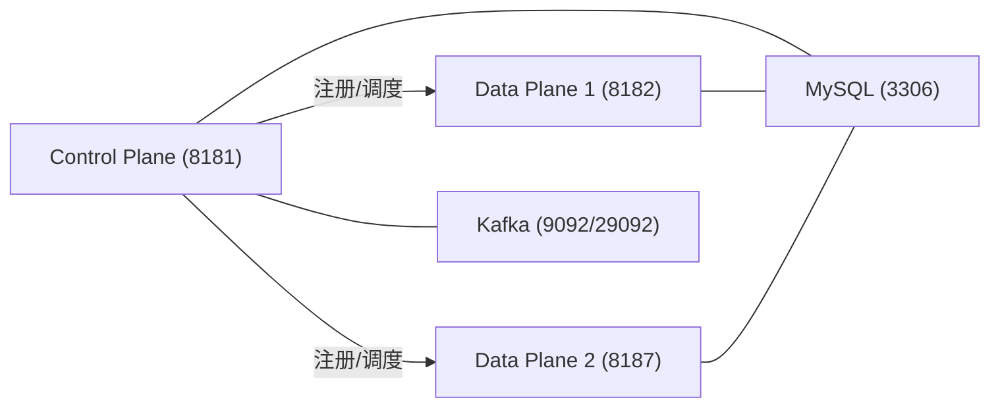

# 技术蓝图（Maven 核心迁移版）

## 1. 目标

把核心能力从“源码对照 Demo”迁移到现有 Maven 模块，实现可运行、可持久化、可扩展的商业流程。

## 2. 架构

## 3. 核心流程

1. Data Plane 启动后自动向 Control Plane 注册。
2. Control Plane 创建资产、合同协商、合同协议。
3. Control Plane 轮询选择 Data Plane 并下发传输启动。
4. Data Plane 生成 EDR 并持久化。
5. Identity/Issuer/Federated 关键接口在执行前调用 Operator 的 `usage/check` 做按次计费校验。
6. Consumer 按 EDR 拉取数据。

## 4. 持久化设计

- 控制面表：`edc_cp_*`
- 数据面表：`edc_dp_*`
- 双节点校验：`count(distinct data_plane_id) >= 2`

## 5. 设计取舍

- 上游 EDC 源码用于能力对照与迁移路线，不直接作为当前主运行时。
- 当前以 Spring Boot + JDBC 先完成可运行核心，后续可逐步替换为更贴近上游 SPI/扩展机制的实现。
